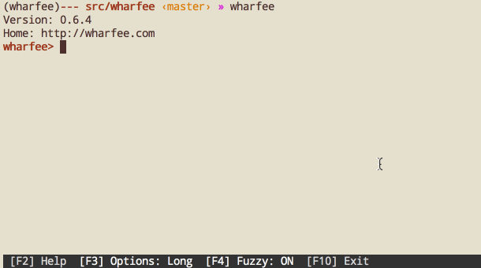
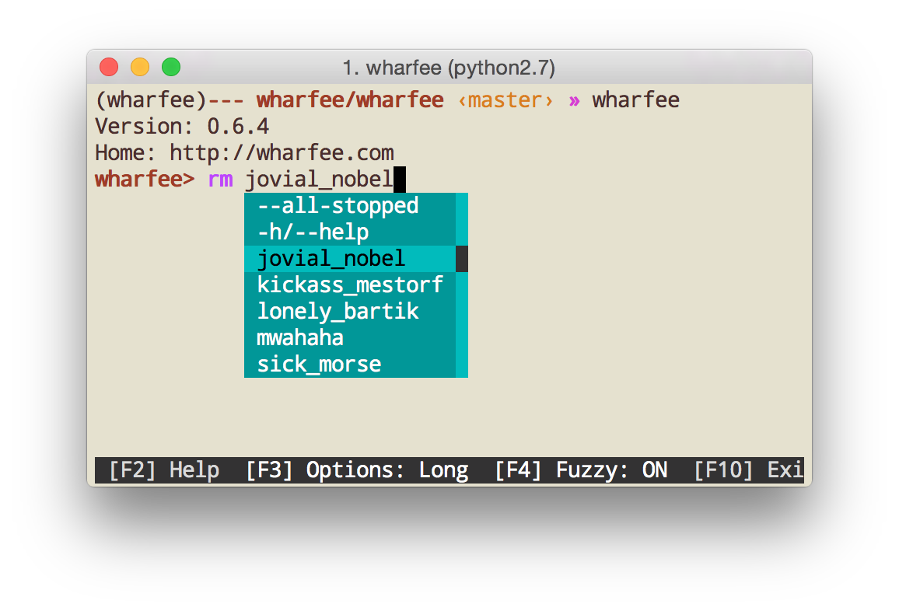
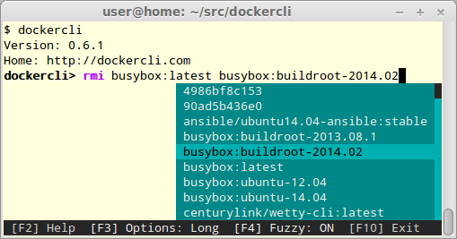
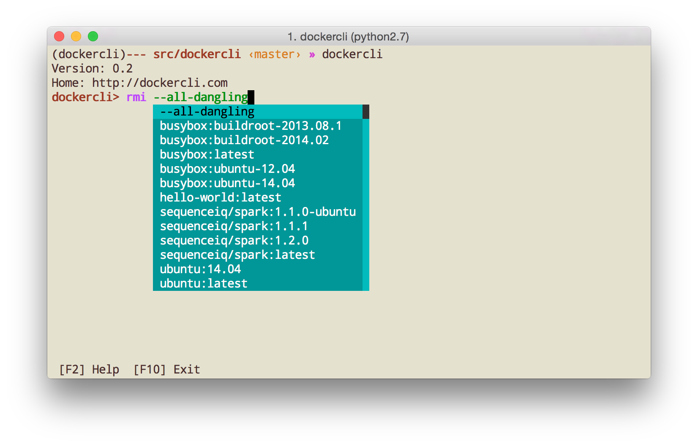
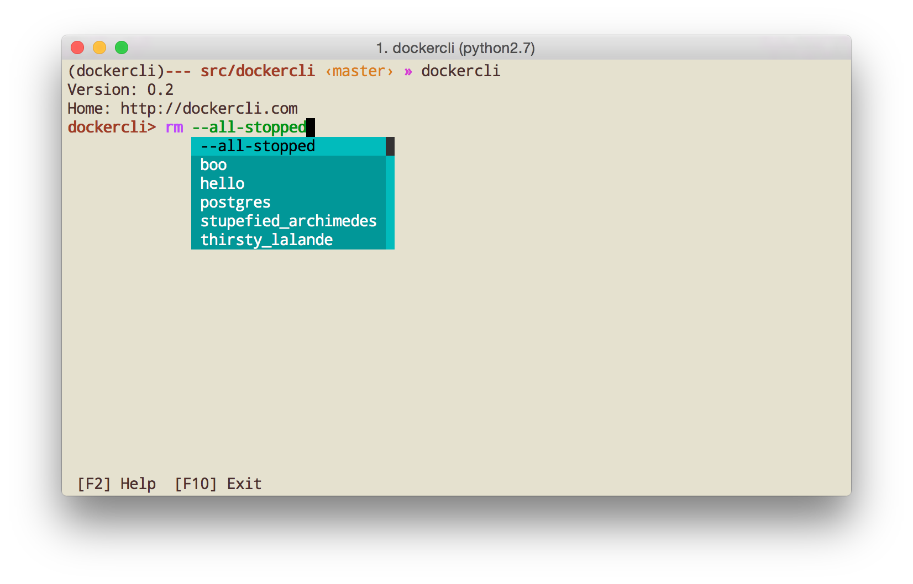

# wharfee

A shell for Docker that can do autocompletion and syntax highlighting.

## Why?

Docker commands have tons of options. They are hard to remember.

Container names are hard to remember and type.

Same goes for image names.

There are some handy shortcuts too. What was that command to remove all dangling images? OMG, what was it? docker rmi $(docker ps --all --quiet)? Oh, there you go:

Boom! How about removing all stopped containers?

## Installation

Wharfee is a Python package hosted on pypi and installed with:

    $ pip install wharfee
    
Alternatively, you can install the latest from github and get all the bugfixes that didn't make it into pypi release yet:

    $ pip install git+https://github.com/j-bennet/wharfee.git

## Running

Wharfee is a console application. You run it from terminal by typing the program name into
the command line:

    $ wharfee
    
If you're on Windows, you may be not so familiar with using the terminal. But if you installed
Docker (Docker Toolbox), you'll have Docker Quickstart Terminal as part of you installation. So,
just as above, you'll run Docker Quickstart Terminal and type `wharfee` into your command prompt.
After you hit `Enter`, you'll see wharfee prompt:

    wharfee>

## What are you using?

* To talk to Docker: [docker-py](https://github.com/docker/docker-py).
* To power the CLI: [Python Prompt Toolkit](http://github.com/jonathanslenders/python-prompt-toolkit).
* To format the output: [tabulate](https://pypi.python.org/pypi/tabulate).
* To print out the output: [Click](http://click.pocoo.org/3/).

## Can I contribute?

Yes! Pull request or [issues](https://github.com/j-bennet/wharfee/issues) are welcome.

## How do you test it?

First, install the requirements for testing:

    $ pip install -r requirements-dev.txt

There are unit tests under *tests*. The command to run them is:

    $ py.test

Additionally, there are integration tests, that can be run with:

    $ cd tests
    $ behave

To see stdout/stderr, use the following command:

    $ behave --no-capture
    
To enter debugger on error, use the following command:
 
    $ behave -D DEBUG_ON_ERROR

## Thanks

